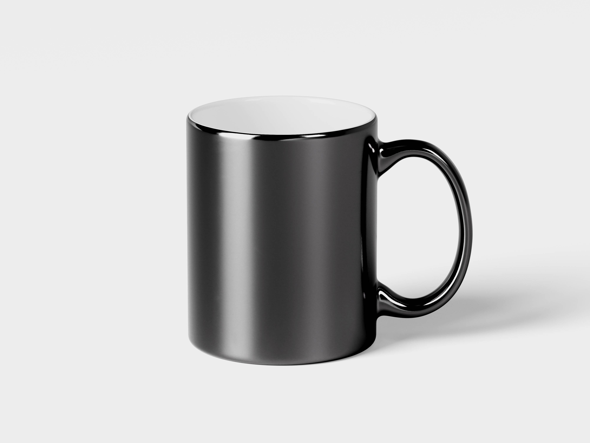
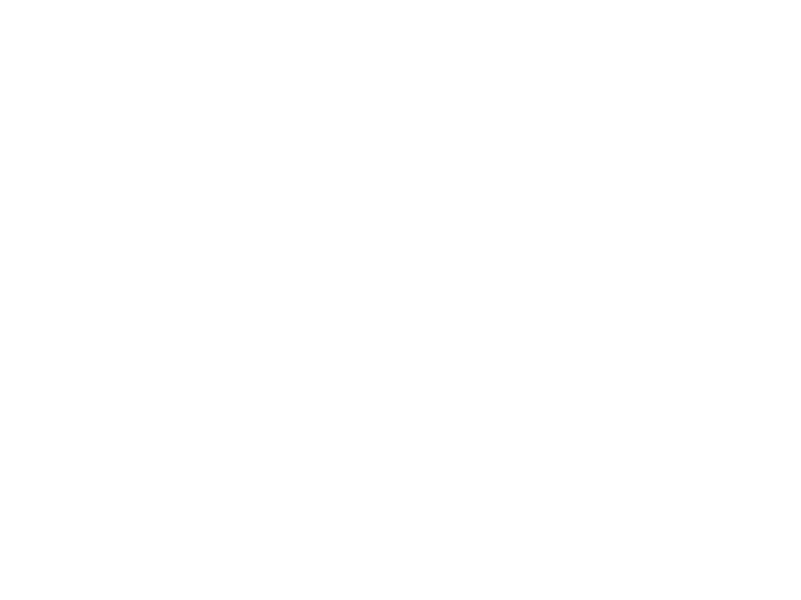
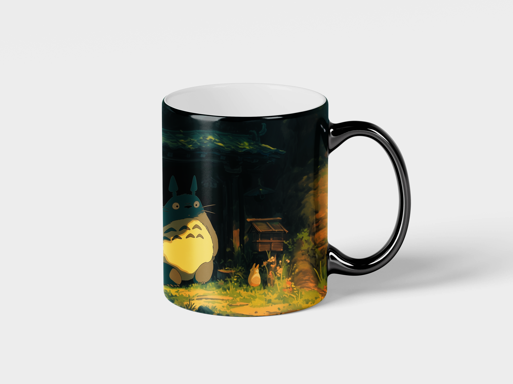

# MockupGenerator

MockupGenerator is a Ruby tool that generates realistic mockups from templates, masks, and artworks using the RMagick library.

## Table of Contents

- [Features](#features)
- [Requirements](#requirements)
- [Installation](#installation)
- [Usage](#usage)
- [Examples](#examples)
- [Results](#results)
- [Explanation of Steps](#explanation-of-steps)

## Features

- Generates adjustment, displacement, and lighting maps to create realistic mockups.
- Supports customization of templates and artworks.
- Uses algorithms to calculate average brightness and adjust the mockup accordingly.

## Requirements

- Ruby (version 2.5 or higher)
- `rmagick` gem
- ImageMagick installed on the system

## Installation

1. **Install ImageMagick** on your system:

   - **macOS**:

     ```bash
     brew install imagemagick
     ```

   - **Ubuntu/Debian**:

     ```bash
     sudo apt-get install imagemagick
     ```

2. **Install the RMagick gem**:

   ```bash
   gem install rmagick
   ```

3. **Clone the repository**:

   ```bash
   git clone https://github.com/your_username/MockupGenerator.git
   ```

4. **Navigate to the project directory**:

   ```bash
   cd MockupGenerator
   ```

## Usage

```ruby
require 'rmagick'
require './mockup_generator'

template = "/path/to/template.jpg"
mask = "/path/to/mask.png"
artwork = "/path/to/artwork.png"

# By default the generator writes the final composite to `mockup.png`
# in the current working directory.
generator = MockupGenerator.new(template, mask, artwork)
image = generator.generate

puts "Final mockup stored at: #{image.filename}" # => ".../mockup.png"

# You can customise the output directory, base filename and whether the
# intermediate maps are persisted by passing keywords either to `new` or `generate`.
custom_generator = MockupGenerator.new(
  template,
  mask,
  artwork,
  output_dir: "/path/to/output",
  basename: "summer_campaign",
  save_intermediate: true
)

# Keyword arguments on `generate` override the defaults set on initialization.
custom_image = custom_generator.generate(save_intermediate: false)

puts custom_image.filename # => "/path/to/output/summer_campaign.png"
```

When `save_intermediate` is `true`, the adjustment, displacement and lighting maps
are written alongside the final mockup using the provided base name (for example,
`summer_campaign_adjustment_map.jpg`). If it is `false`—the default—only the final
composite image is saved.

## Examples

### Template

Base image where the artwork will be applied.



### Mask

Defines the area where the artwork will be positioned on the template.



### Artwork

The image that will be inserted into the mockup.


## Results

After running the script, you will get a mockup with the artwork applied realistically.



## Explanation of Steps

1. **Generation of Adjustment Map**: Creates a map that adjusts the brightness and contrast of the artwork to match the template.

2. **Generation of Displacement Map**: Applies a displacement effect to simulate the texture and contours of the template on the artwork.

3. **Generation of Lighting Map**: Adjusts the lighting of the artwork to correspond with the lighting of the template.

4. **Generation of the Final Mockup**: Combines all the maps and applies the artwork to the template, producing the final mockup.